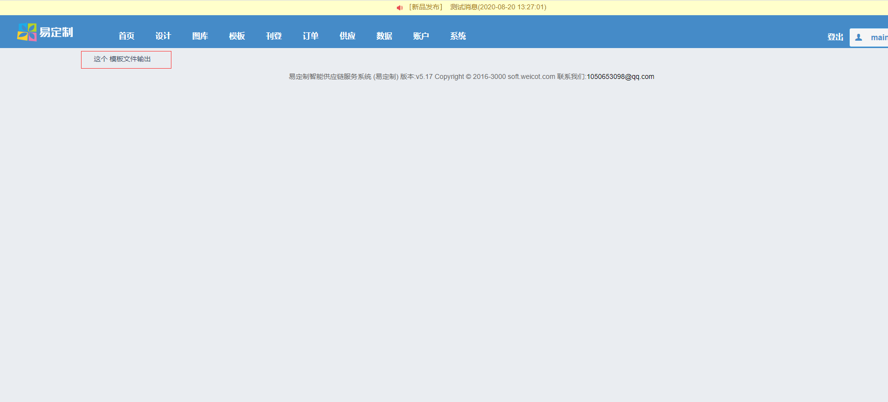
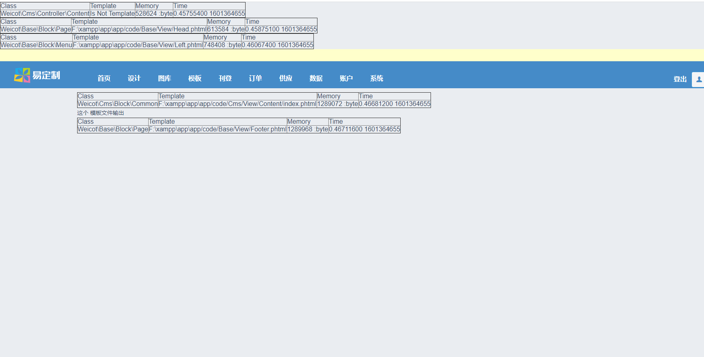
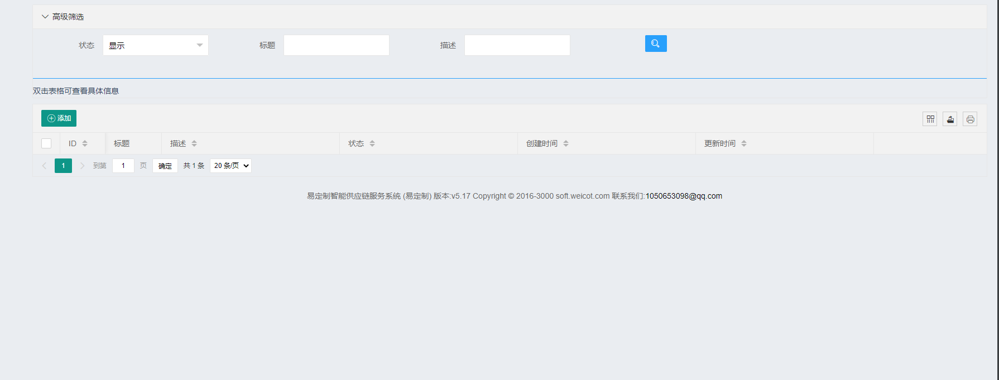
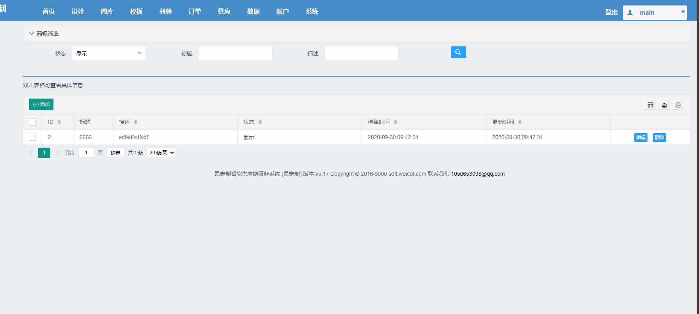
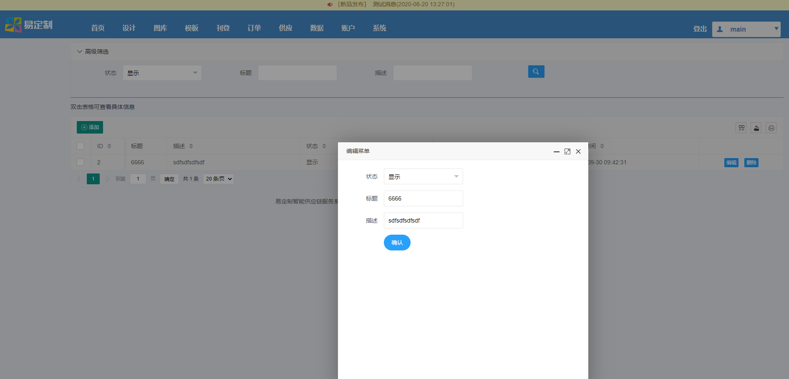

 
# WeiCot Framework  快速开发教程 - 如何手动创建一个模块以Cms为例  
### WeiCot Framework  快速开发教程 -www.weicot.com 
#### 也支持通过命令行快速自动生成模块并加载以及生成读写查询代码


###基本开发规范 
- 1.命名空间 开头必需大写  namespace  Weicot\Core\Controller
- 2.类名开头大写 用驼峰法命名 class  BaseExample{}
- 3.应用/模块开头必需大写 /Core
- 4.函数 开头小写  public function getPage()
- 6.以双下划线“__”打头的函数或方法作为魔法方法，例如 __call 和 __autoload；
- 7.建议每个模块写出详细的说明文档 日期，作者，功能，返回类型
  
 ### 1.在 composer.json 中新增加一条 
  ```json
  "autoload": {
       "psr-4": {
         "Weicot\\Cms\\Block\\": "app/code/Cms/Block",
         "Weicot\\Cms\\Controller\\": "app/code/Cms/Controller",
         "Weicot\\Cms\\Data\\": "app/code/Cms/Data",
         "Weicot\\Cms\\Model\\": "app/code/Cms/Model",
  ```
       
       
### 2.在当前目录下执行 
```php
 php composer.phar dump-autoload  
 
```
     
      
### 3.后在 app/code/下创建相应的模块目录结构
- app/code/Cms/Block
- app/code/Cms/Controller
- app/code/Cms/Data
- app/code/Cms/Model
- app/code/Cms/View
### 4.新增加表    
- 1.直接在数据库中新增加
 ```sql
 CREATE TABLE `cms`
 (
     id          int unsigned auto_increment
         primary key,
     user_id     int(10)                     null comment '创建的用户id',
     title       varchar(255)     default '' not null comment '标题',
     description longtext                    null comment '内容',
     status      tinyint unsigned default 1  not null comment '状态  1显示  2隐藏',
     created     int              default 0  not null comment '创建时间',
     updated     int              default 0  not null comment '更新时间'
 
 ) ENGINE = InnoDB
   DEFAULT CHARSET = utf8 COMMENT 'cms 表';

```
- 2.或者在app/code/Cms/Data 目录下通过创建 Install.php 类新增加 
   
   
 
 
### 5.在 app/code/Cms/Controller中创建控制器
-  app\code\Cms\Controller\Content.php
 ```php
<?php
  
  namespace Weicot\Cms\Controller;
  
  use Weicot\Core\Controller;
  
  class Content extends Controller
  {
  
      public function index()
      {
          parent::index(); // TODO: Change the autogenerated stub
      }
  
  }
  
 ```
以上步骤完成后 
打开浏览器http://www.<你的IP地址>.com/cms/content你会发现是一个空白页面. 
 

### 6.下面我们来为其引入前端布局以及页面
- 1.创建一个空的 Block  以及一个空的模板文件
> app\app\code\Cms\Block\Common.php
```php
<?php

namespace Weicot\Cms\Block;

use Weicot\Core\Block;

class Common extends Block
{


}

```

- 2.模板文件
> app\code\Cms\View\Content\index.phtml
> 在模板中添加这一段文字  <这个 模板文件输出

- 3.在控制器中引入布局
 > app\code\Cms\Controller\Content.php  
```php
     public function index()
     {
         /***
          * 此方法 支持数据传递  支持添加多个模板 支持添加 js 或 CSS 文件等
          */
         $this->setView()->addTemplate(
             array(
                 "blockName" => "Cms.Common",
                 "templatePath" => "Cms/View/Content/index",
             )
         )->setLayout()->toHtml();
     }
 

```
添加完成后 我们可以看到  这个控制器下面的模板文件输出  
  

> 想要直接显示   block  与模板（template）的引用关系 可以直接 在配置文件( app\app\etc\Config.php)中开启 debug 下的  show_path即可
 ```php
    "debug" => [
          'display_errors' => true,  //显示错误信息
          'show_path' => false,//是否 显示Controller地址地址及类名  显示Block地址及类名 显示Template地址及类名  false
          'design_tools' => false,  //设计工具是否开启 debug
      ],
 
 ```
 > 效果如下 
  
 

 
### 7.创建model
 > app\code\Cms\Model\Content.php
 
 ```php
<?php
 
 namespace Weicot\Cms\Model;
 
 use Weicot\Coer\Model;
 
 class Content extends Model
 {
     public $table = 'cms';
     public $field = ['id', 'user_id', 'title', 'description', 'status', 'created', 'updated'];
     public static $status = [
         1 => "显示",
         2 => "隐藏",
     ];
 
 }
 
 ```
### 8.现在我们来创建读写查询页面 
 
- 1.在模板文件中增加如下内容
```html
<?php

use Weicot\Customer\Model\Session;

$block->usePackageJs("layui/common");
?>
    <style>
        .layui-input-block.options-box-group-child {
            margin: 0;
        }
    </style>
    <script>
        layui.use(['element', 'layer'], function () {
            var element = layui.element;
            var layer = layui.layer;
            element.on('collapse(z_search)', function (data) {
            });
        });
    </script>
    <div class="x-body">
        <!--搜索-->
        <div class="layui-collapse" lay-filter="z_search">
            <div class="layui-colla-item">
                <h2 class="layui-colla-title">高级筛选</h2>
                <div class="layui-colla-content layui-show">
                    <div class="layui-row">
                        <form class="layui-form layui-col-md12 x-so" id="zq_search">
                            <div class="layui-form-item">


                                <div class="layui-inline">
                                    <label class="layui-form-label">状态</label>
                                    <div class="layui-input-inline">
                                        <?php echo $block->eachSelect(\Weicot\Cms\Model\Content::$status, 'status', true, 1); ?>
                                    </div>
                                </div>


                                <div class="layui-inline">
                                    <label class="layui-form-label">标题</label>
                                    <div class="layui-input-inline">
                                        <input type="text" name="title" id="title"
                                               placeholder="标题"
                                               autocomplete="off" class="layui-input">
                                    </div>
                                </div>
                                <div class="layui-inline">
                                    <label class="layui-form-label">描述</label>
                                    <div class="layui-input-inline">
                                        <input type="text" name="description" id="description"
                                               placeholder="描述"
                                               autocomplete="off" class="layui-input">
                                    </div>
                                </div>


                                <div class="layui-inline">
                                    <label class="layui-form-label"></label>
                                    <div class="layui-input-block">
                                        <button id="search" class="layui-btn   layui-btn-sm layui-btn-normal "
                                                lay-submit=""
                                                lay-filter="search"><i
                                                    class="layui-icon">&#xe615;</i></button>
                                    </div>

                                </div>
                            </div>

                        </form>
                    </div>
                </div>
            </div>
            <hr class="layui-bg-blue">
            双击表格可查看具体信息
        </div>
        <table class="layui-hide" id="zq_table" lay-filter="zq_table"></table>


        <!--添加-->
        <div class="layui-row" id="zq_formpopbox"
             style="display:none;position: absolute; top: 0; left: 0; bottom: 0; right: 0;">
            <div class="layui-col-md11">
                <form id="zq_form" class="layui-form" action="" style="margin-top: 20px;align:center;">


                    <div class="layui-form-item">
                        <label class="layui-form-label">状态</label>
                        <div class="layui-input-inline">
                            <?php echo $block->eachSelect(\Weicot\Cms\Model\Content::$status, 'status', true, 1); ?>
                        </div>
                    </div>


                    <div class="layui-form-item">
                        <label class="layui-form-label">标题</label>
                        <div class="layui-input-inline">
                            <input type="text" name="title" id="title"
                                   placeholder="标题"
                                   autocomplete="off"
                                   lay-verify="required"
                                   class="layui-input">
                        </div>
                    </div>
                    <div class="layui-form-item">
                        <label class="layui-form-label">描述</label>
                        <div class="layui-input-inline">
                            <input type="text" name="description" id="description"
                                   placeholder="描述"
                                   autocomplete="off"
                                   lay-verify="required"
                                   class="layui-input">
                        </div>
                    </div>
                    <div class="layui-form-item">
                        <div class="layui-input-block">
                            <button class="layui-btn layui-btn-radius layui-btn-normal" lay-submit=""
                                    lay-filter="zq_submit">
                                确认
                            </button>
                            <button type="reset" class="layui-btn layui-btn-radius layui-btn-primary">重置</button>
                        </div>
                    </div>
                </form>
            </div>
        </div>

        <!--编辑-->
        <div class="layui-row" id="zq_edit_formpopbox"
             style="display:none;position: absolute;  top: 0; left: 0; bottom: 0; right: 0;">
            <div class="layui-col-md11">
                <form id="zq_edit_form" class="layui-form" action="" style="margin-top: 20px;align:center;">
                    <input type="hidden" name="id"/>

                    <div class="layui-form-item">
                        <label class="layui-form-label">状态</label>
                        <div class="layui-input-inline">
                            <?php echo $block->eachSelect(\Weicot\Cms\Model\Content::$status, 'status', true, 1); ?>
                        </div>
                    </div>


                    <div class="layui-form-item">
                        <label class="layui-form-label">标题</label>
                        <div class="layui-input-inline">
                            <input type="text" name="title" id="title"
                                   placeholder="标题"
                                   autocomplete="off"
                                   lay-verify="required"
                                   class="layui-input">
                        </div>
                    </div>
                    <div class="layui-form-item">
                        <label class="layui-form-label">描述</label>
                        <div class="layui-input-inline">
                            <input type="text" name="description" id="description"
                                   placeholder="描述"
                                   autocomplete="off"
                                   lay-verify="required"
                                   class="layui-input">
                        </div>
                    </div>
                    <div class="layui-form-item">
                        <div class="layui-input-block">

                            <button class="layui-btn layui-btn-radius layui-btn-normal" lay-submit=""
                                    lay-filter="zq_edit_submit">
                                确认
                            </button>

                        </div>
                    </div>
                </form>
            </div>
        </div>
        <table class="layui-hide" id="zq_table" lay-filter="zq_table"></table>
        <script type="text/html" id="zq_toolbar">
            <div class="layui-btn-container">
                <button class="layui-btn layui-btn-sm" lay-event="add"><i class="layui-icon"></i>添加</button>
            </div>

            </div>
        </script>
        <script type="text/html" id="zq_bar">

            <a class="layui-btn  layui-btn-normal layui-btn-xs" lay-event="edit">编辑</a>
            <?php if (Session::isManage()) { ?>
                <a class="layui-btn  layui-btn-normal layui-btn-xs" lay-event="del">删除</a>
            <?php } ?>
        </script>
        <script>
            var config = {
                'version':<?php  echo __config('site', 'layui_version') ?> ,
            };
        </script>
<?php

//echo $block->setJs("content", false, '1596184778');
//将固定数值改为动态的 防止缓存  当然你也可以直接把js 放到当前页面中这样就不用额外的引入js文件了
echo $block->setJs("content", false, time());
?>


```

- 2.并创建相应的js文件   
> app\skin\frontend\js\content.js
```javascript

$(function () {
    layui.config({
        version: config.version
    });
    layui.use(['table', 'layer', 'form', 'laypage', 'upload', 'laydate'], function () {
        var table = layui.table
            , layer = layui.layer
            , form = layui.form
            , laypage = layui.laypage
            , upload = layui.upload
            , laydate = layui.laydate;


        table.render({
            elem: '#zq_table'
            , id: 'tableReload'
            , url: '/cms/content/page'
            , toolbar: '#zq_toolbar'
            , title: '模板'
            , page: true //开启分页
            , limit: 20
            // ,totalRow: true //开启合计行
            , cols: [[ //表头
                {type: 'checkbox', fixed: 'left'}
                , {field: 'id', title: 'ID', width: 80, sort: true, fixed: 'left', totalRowText: '合计：'}
                , {field: 'title', width: 100, title: '标题',}
                , {field: 'description', title: '描述', sort: true, totalRow: true,}
                , {field: 'status_name', title: '状态', sort: true, totalRow: true,}
                , {field: 'created', title: '创建时间', sort: true, totalRow: true,}
                , {field: 'updated', title: '更新时间', sort: true, totalRow: true,}
                , {fixed: 'right', width: 200, align: 'center', toolbar: '#zq_bar'}
            ]],
            parseData: function (res) {
                return {
                    code: res.status == true ? 0 : 1,
                    msg: res.mesg,
                    count: res.data.count,
                    data: res.data.list
                }
            },
        });


        table.on('toolbar(zq_table)', function (obj) {
            var checkStatus = table.checkStatus(obj.config.id)
                , data = checkStatus.data;
            data = eval("(" + JSON.stringify(data) + ")");
            switch (obj.event) {
                case 'add':
                    zq_form('添加菜单', '', '700', '700');
                    $("#zq_form").setForm({id: ''});
                    form.render();

                    break;
            }
        });


        table.on('tool(zq_table)', function (obj) {
            var data = obj.data
                , layEvent = obj.event;
            var tr = obj.tr;
            switch (layEvent) {
                case 'del':
                    layer.confirm('您确定删除id：' + data.id + '的数据吗？', function (index) {

                        $.post("/cms/content/del", {id: data.id}, function (ret) {
                            if (ret.status) {
                                layer.msg(ret.msg, {icon: 1, time: 1500}, function () {
                                    obj.del();
                                    layer.close(index);

                                });
                            } else if (ret.status == false) {  //删除失败
                                layer.alert(ret.msg, {icon: 2}, function () {
                                    layer.close(index);

                                    window.location.reload();
                                });
                            }


                        });
                    });
                    break;
                case 'edit':
                    zq_edit_form('编辑菜单', '', 600, 600);
                    $("#zq_edit_form").setForm(data);
                    form.render();
                    break;
            }
        });


        table.on('edit(zq_table)', function (obj) {

            var value = obj.value
                , data = obj.data
                , did = obj.id
                , field = obj.field; //得到字段


            $.ajax({
                type: "post",
                url: "/cms/content/quickEdit",
                data: {
                    'field': field,
                    'value': value,
                    'did': did,
                    'row': data,

                },
                dataType: "json",
                success: function (msg) {
                    if (msg.status) {
                        layer.msg(msg.msg, {icon: 1, time: 1500});
                        table.reload('tableReload');
                        layer.close(index);
                    } else {
                        layer.alert(msg.msg, {icon: 2}, function () {

                            layer.close(index);

                        });
                    }
                }
            });
            return false;

            layer.msg('[ID: ' + data.id + '] ' + field + ' 字段更改为：' + value);
        });

        form.on('submit(zq_submit)', function (data) {

            var formData = data.field;
            $.ajax({
                type: "post",
                url: "/cms/content/add",
                data: formData,
                dataType: "json",
                success: function (msg) {

                    if (msg.status) {
                        layer.msg(msg.msg, {icon: 1, time: 1500});
                        table.reload('tableReload');
                        layer.close(index);
                    } else {
                        layer.alert(msg.msg, {icon: 2}, function () {

                            layer.close(index);

                        });
                    }
                }
            });
            return false;
        });

        table.on('rowDouble(zq_table)', function (obj) {
            var data = obj.data;
            layer.open({
                type: 2,
                title: '查看',
                maxmin: true,
                shadeClose: true,
                area: ['1200px', '900px'],
                content: '/cms/content/detail?id=' + data.id
            });
            obj.tr.addClass('layui-table-click').siblings().removeClass('layui-table-click');
        });


        form.on('submit(zq_edit_submit)', function (data) {
            var formData = data.field;
            $.ajax({
                type: "post",
                url: "/cms/content/edit",
                data: formData,
                dataType: "json",
                success: function (msg) {
                    if (msg.status) {
                        layer.msg(msg.msg, {icon: 1, time: 1500});
                        table.reload('tableReload');
                        layer.close(index);
                    } else {
                        layer.alert(msg.msg, {icon: 2}, function () {

                            layer.close(index);

                        });
                    }
                }
            });
            return false;
        });


        form.on('submit(search)', function (data) {
            var formData = data.field;
            table.reload('tableReload', {
                page: {
                    curr: 1
                }
                , where: formData
                , url: '/cms/content/page'
                , method: 'post'
            });
            return false;
        });


    });


});


var index;

//表单弹出层
function zq_edit_form(title, url, w, h) {
    if (title == null || title == '') {
        title = false;
    }
    ;
    if (url == null || url == '') {
    }
    ;// url="404.html";
    if (w == null || w == '') {
        w = ($(window).width() * 0.9);
    }
    ;
    if (h == null || h == '') {
        h = ($(window).height() - 50);
    }
    ;
    index = layer.open({
        type: 1,
        title: title,

        area: [w + 'px', h + 'px'],
        fix: false, //不固定
        maxmin: true,
        shadeClose: true,
        shade: 0.4,//背景灰度
        content: $("#zq_edit_formpopbox").html()
    });
}


function zq_detail_form(title, url, w, h) {
    if (title == null || title == '') {
        title = false;
    }
    ;
    if (url == null || url == '') {
    }
    ;// url="404.html";
    if (w == null || w == '') {
        w = ($(window).width() * 0.9);
    }
    ;
    if (h == null || h == '') {
        h = ($(window).height() - 50);
    }
    ;
    index = layer.open({
        type: 1,
        title: title,

        area: [w + 'px', h + 'px'],
        fix: false, //不固定
        maxmin: true,
        shadeClose: true,
        shade: 0.4,//背景灰度
        content: $("#zq_detail_formpopbox").html()
    });
}

function zq_form(title, url, w, h) {
    if (title == null || title == '') {
        title = false;
    }
    ;
    if (url == null || url == '') {
    }
    ;// url="404.html";
    if (w == null || w == '') {
        w = ($(window).width() * 0.9);
    }
    ;
    if (h == null || h == '') {
        h = ($(window).height() - 50);
    }
    ;
    index = layer.open({
        type: 1,
        title: title,

        area: [w + 'px', h + 'px'],
        fix: false, //不固定
        maxmin: true,
        shadeClose: true,
        shade: 0.4,//背景灰度
        content: $("#zq_formpopbox").html(),
        yes: function (index, layero) {

            // uploadInst.reload();
        }
    });


}

```
做完以上两部后访问控制器你可以看到一个空白的页面
 
 
### 9.现在我们来实现读写查询的 action  函数
 - 1.打开刚才创建的控制器类生成以下函数
 > app\code\Cms\Controller\Content.php
 ```php
<?php

 namespace Weicot\Cms\Controller;
 
 use Weicot\Core\Controller;
 
 class Content extends Controller
 {
 
     public function index()
     {
         /***
          * 此方法 支持数据传递  支持添加多个模板 支持添加 js 或 CSS 文件等
          */
         $this->setView()->addTemplate(
             array(
                 "blockName" => "Cms.Common",
                 "templatePath" => "Cms/View/Content/index",
             )
         )->setLayout()->toHtml();
     }
 
 
     public function page()
     {
         parent::page(); // TODO: Change the autogenerated stub
     }
 
     public function edit()
     {
         parent::edit(); // TODO: Change the autogenerated stub
     }
 
     public function del()
     {
        parent::del(); // TODO: Change the autogenerated stub
     }
    
     public function detail()
     {
         parent::detail(); // TODO: Change the autogenerated stub
     }
 
     public function quickEdit()
     {
         parent::quickEdit(); // TODO: Change the autogenerated stub
     }
 }

```
- 2 现在我们开始来写翻页方法

```php
 public function page()
    {
        $filter = $this->post();
        $query = Db::table($this->model->table)->field($this->model->field);
        if (isset($filter['status']) && $filter['status'] != '') {
            $query->where('status', '=', $filter['status']);
        }
        if (isset($filter['title']) && $filter['title'] != '') {
            $query->where('title', 'like', '%' . $filter['title'] . '%');
        }
        if (isset($filter['description']) && $filter['description'] != '') {
            $query->where('description', 'like', '%' . $filter['description'] . '%');
        }
        $count = $query->count();
        $list = $query->page($this->getPage(), $this->getLimit())->order('id', 'desc')->select();
        foreach ($list as &$item) {
            $item['created'] = $item['created'] >= 1 ? date("Y-m-d H:i:s", $item['created']) : "";
            $item['updated'] = $item['updated'] >= 1 ? date("Y-m-d H:i:s", $item['updated']) : "";
            $item['status_name'] = Help::getArrayValue(\Weicot\Cms\Model\Content::$status, $item['status']);
        }
        $this->success('分页数据', 1111, [
            'count' => $count,
            'list' => $list
        ]);
    }

```

- 3.我们现在开始来写添加方法

```php

    /***
     * 添加函数
     */
    public function add()
    {
        $data = $this->post();
        if (!empty($data)) {
            if (isset($data['title']) && isset($data['description']) && !empty($data['title'])) {
                $save = Help::getFormatArrayData($data, $this->model->field, false);
                $save['created'] = time();
                $save['updated'] = time();
                Db::table($this->model->table)->insert($save);
                $id = Db::getLastInsID();
                if ($id) {
                    $this->success('添加成功', 1111, ['id' => $id]);
                }
                $this->error('添加失败');
            }
        }
        $this->error('提交数据不全');
    }

```
 做完这一步之后你可以尝试添加一次数据  添加成功后刷新页面  就可以看到您刚才添加的数据啦
  
 
 现在我们写完了数据添加以及显示的 action 做编辑和删除的 action 啦
 继续在我们当前的控制器文件 写入以下代码
 - 4.增加编辑方法
 ```php
    /***
     * 编辑函数
     */
    public function edit()
    {
        $data = $this->post();
        if (!empty($data)) {
            if (isset($data['id']) && isset($data['title']) && !empty($data['title']) && !empty($data['id'])) {
                $save = Help::getFormatArrayData($data, $this->model->field, false);
                $id = $save['id'];
                unset($save['id']);
                $save['updated'] = time();
                if (Db::table($this->model->table)->where('id', '=', $id)->update($save)) {
                    $this->success('修改成功', 1111, ['id' => $id]);
                };
                $this->error('修改失败');
            }
        }
        $this->error('提交数据不全');
    }
    
 ```
 
- 5. 然后是增加删除的方法

```php


    /***
     * 删除
     * @throws \think\Exception
     * @throws \think\db\exception\PDOException
     */
    function del()
    {
        $id = $this->post('id');
        if ($id) {
            $status = Db::table($this->model->table)
                ->where('id', '=', $id)
                ->delete();
            if ($status) {
                $this->success('删除成功', 1111);
            };
        }

        $this->error('删除失败');
    }


```     

自此一个读写查询模块就完成啦
  


     
 
 
 
 
 ### 10 如何禁止未经登录的访问  
 - 基础权限控制
 > app\code\Base\Model\AccessControl.php
 ```php
<?php
   /**
    *@ lib\Core\AccessControl.php
    */
   
   namespace Weicot\Base\Model;
   
   class AccessControl extends \Weicot\Core\AccessControl
   {
   
       /***
        * 不需要登录就可以进行访问的链接
        * @return array
        */
       public function noLoginRule()
       {
           return [
               "customer" => [
                   "customer/login/index",
                   "customer/login/create",
                   "customer/action/login",
                   "customer/action/create",
                   "customer/action/ajaxLogin",
                   "customer/action/ajaxCreate"
               ],
               "base" => [
                   "base/home/captcha",
                   "base/home/captchalogin",
                   "base/home/about",
                   "base/home/execute",
                   "base/home/serviceClause",
                   "base/home/copyrightStatement"
               ],
           ];
       }
   }
 
 ```
 
  
 
 
- 2 或者通过控制器 $noNeedLogin=[] 的方式进行设置 方法为 $noNeedLogin=['action1','action2'] 


 ### 11 快速指导
 - 1.App Name/Controller Name/Function Name             //路由 方法
 - 2.http://www.weicot.com/base/index/home              //访问路径
 - 3.namespace Weicot\Base\Controller\Index::home;      //调用方法
 - 4.如果控制器不存在action 则执行默认的 execute 控制，其中默认的index最后也会被定向到execute函数
 - 5.注意在模块中 Class Name =File Nmae  类名=文件名 
 - 6.namespace Weicot\Base\View                      //视图基类
 - 7.namespace Weicot\Base\View                      //基类
>         将模板压入数组
>         $this->template[] = array(                      //可同时设置多个模板
>          "blockName" => "Base.Header",   //Weicot/Base/Block
>          "templatePath" => "Base/View/Header",           // Base/View/Header.phtml
>          );
- 8.二级调用
> "blockName" => "Base.Header.Function.Value",
>  Weicot/Base/Block::Header->Function(Value)
- 9.View 可以在模板文件中以块级单位调用
>  使用 View 中的 createBlock 进行创建
 
 
### 12 涉及的开源项目
**前端主要使用的开源项目  layui**
- [layui](https://www.layui.com/ "layui")
- [layui 文档](https://www.layui.com/doc/ "layui 文档")

**后端经常使用的ORM  thinkphp-5 orm**
- [think-orm](https://github.com/top-think/think-orm "think-orm")
- [think-orm 文档](https://www.kancloud.cn/manual/think-orm/1257998 "think-orm 文档")

**WeiCot Framework 作者官网**
- [weicot.com](http://www.weicot.com/ "weicot.com")
